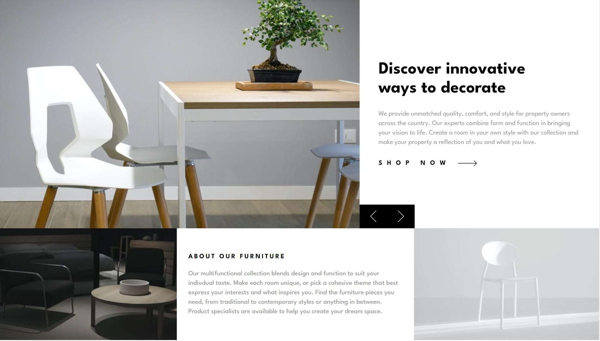

# Frontend Mentor - Results summary component solution

This is a solution to the [Room Homepage challenge on Frontend Mentor](https://www.frontendmentor.io/challenges/results-summary-component-CE_K6s0maV). Frontend Mentor challenges help you improve your coding skills by building realistic projects.

## Table of contents

-   [Overview](#overview)
    -   [The challenge](#the-challenge)
    -   [Screenshot](#screenshot)
    -   [Links](#links)
    -   [Built with](#built-with)
    -   [Continued development](#continued-development)
    -   [Useful resources](#useful-resources)

## Overview

### The challenge

Users should be able to:

-   View the optimal layout for the interface depending on their device's screen size
-   See hover and focus states for all interactive elements on the page

### Screenshot

### Links

-   Solution URL:
-   Live Site URL: https://dlee1993.github.io/FEM-room-homepage/

### Built with

-   Semantic HTML5 markup
-   Mobile-first workflow
-   [React](https://reactjs.org/) - JS library

### Continued development

I strive to build my tailwindcss skills

### Useful resources

-   Tailwindcss Docs (https://www.tailwindcss.com)

## Author

-   Frontend Mentor - https://www.frontendmentor.io/profile/DLee1993
